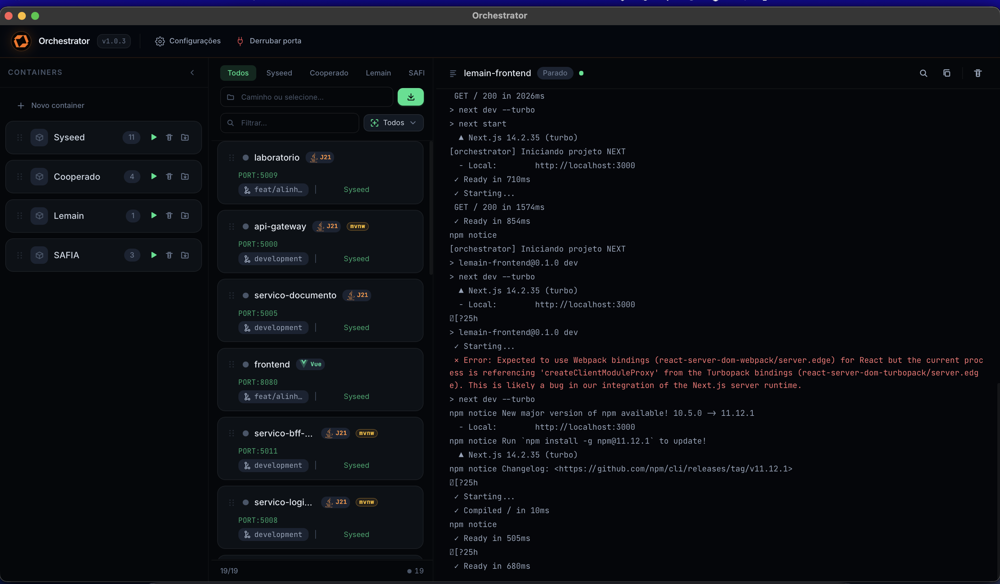
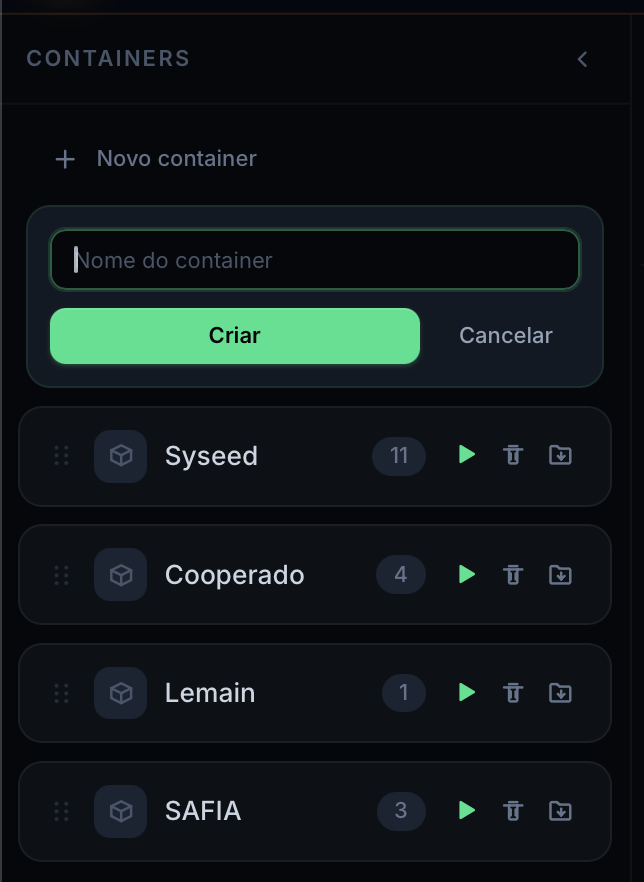
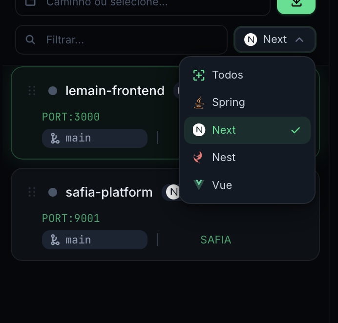
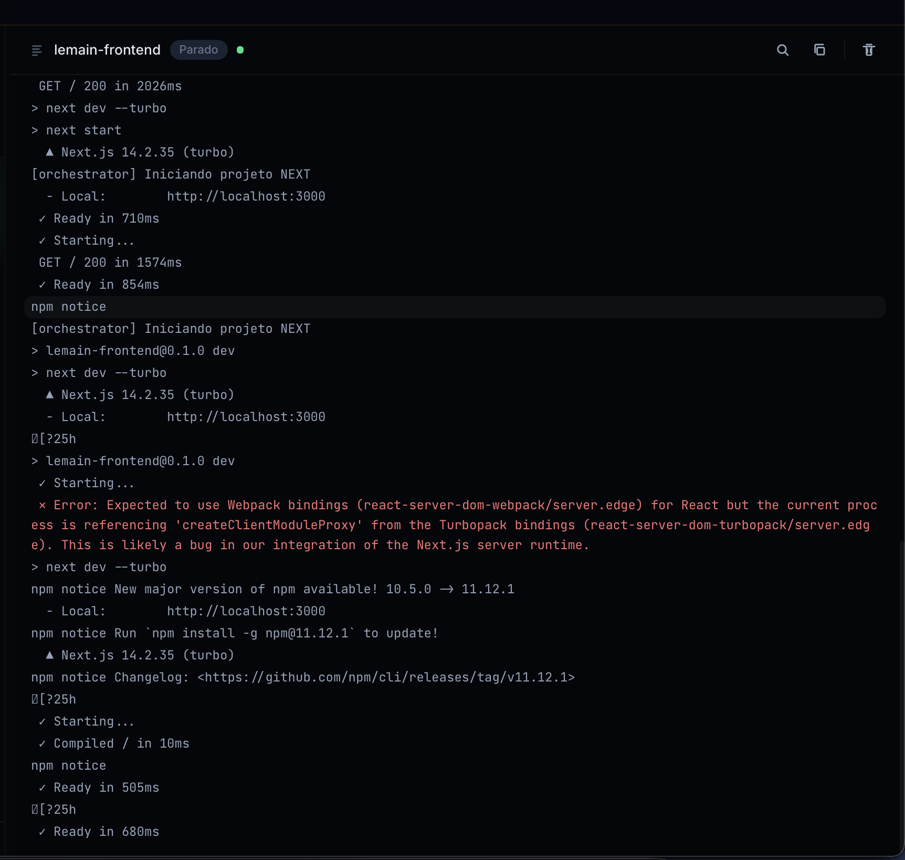
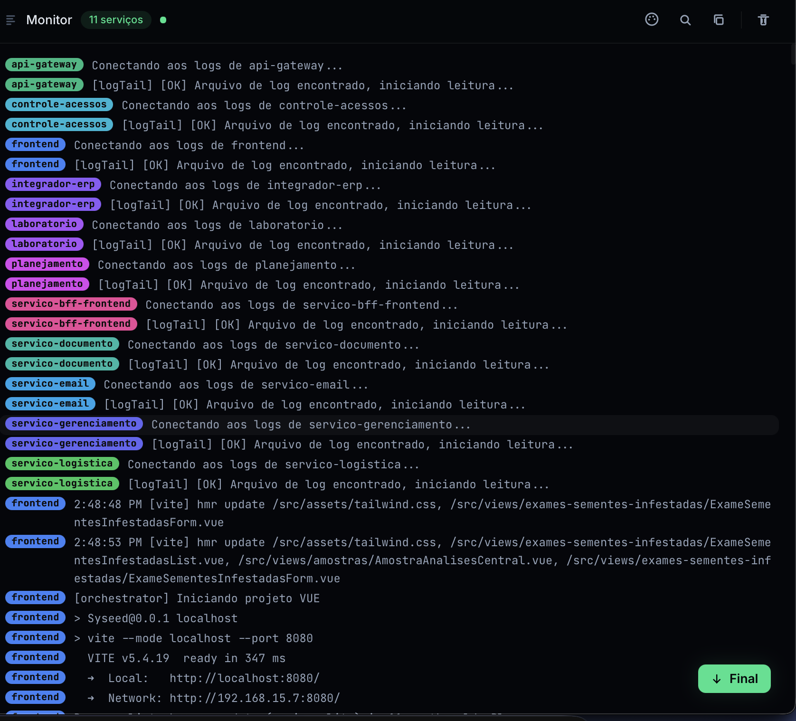
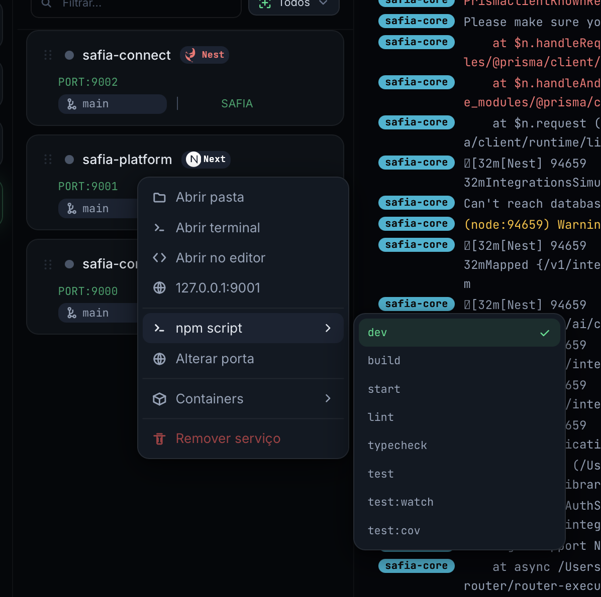
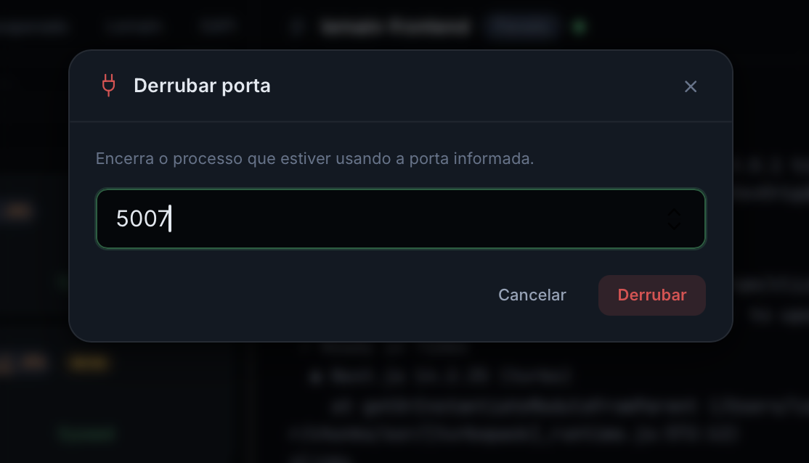
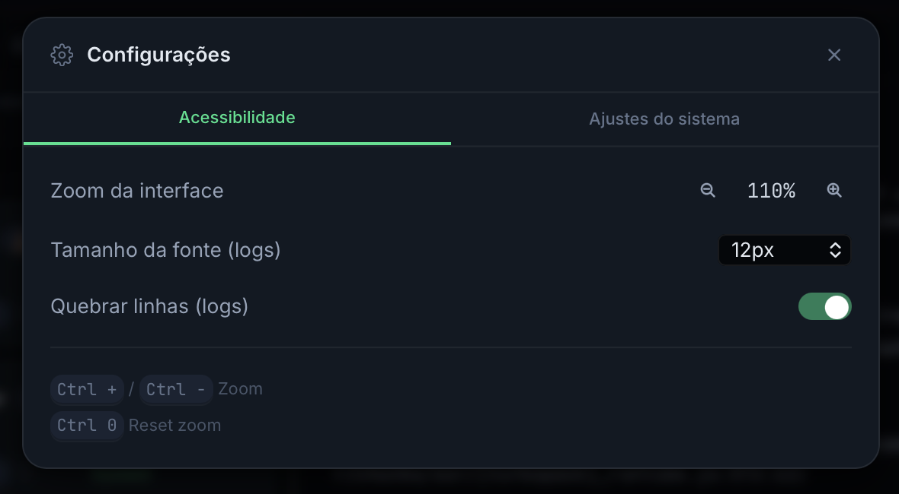
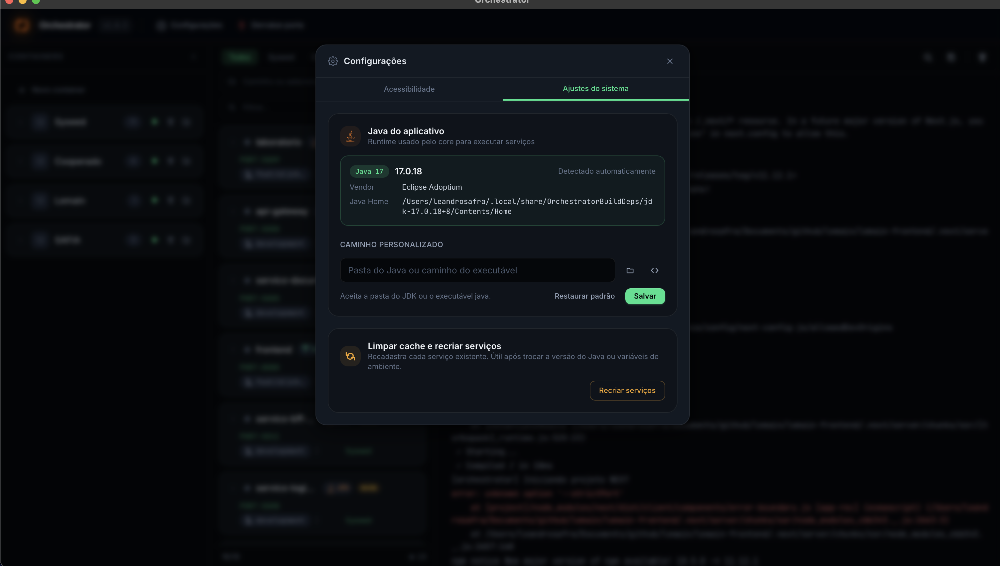

# Orchestrator — Desktop app to run and manage local dev servers

<p align="center">
  <strong>Professional desktop control plane for local development services.</strong><br>
  Start, stop, and monitor Spring Boot, Node.js, PHP, and static projects from one place — no Docker required.
</p>

<p align="center">
  Import folders, auto-detect projects, group services into containers, stream logs, switch scripts and ports, and free stuck ports.<br>
  Built for developers who run <strong>multiple local servers</strong> (APIs, frontends, Laravel, Symfony) and want a single <strong>orchestrator for dev environments</strong> on macOS, Windows, and Linux.
</p>

<p align="center">
  <a href="https://github.com/SafraPC/orchestrator/releases/latest">
    
  </a>
  <a href="https://github.com/SafraPC/orchestrator/releases/latest">
    
  </a>
  <a href="./LICENSE">
    
  </a>
  
</p>

<p align="center">
  
</p>

---

## What It Delivers

- **One app for many stacks** — Java (Spring Boot), JavaScript/TypeScript (React, Next.js, NestJS, Angular, Vue), PHP (Laravel, Symfony, Composer), and plain HTML/JS/PHP files.
- Centralized control for local dev servers on macOS, Windows, and Linux.
- Clean grouping with logical containers (not Docker — logical start/stop groups).
- Fast start, stop, and restart flows with keyboard shortcuts.
- Live logs with search, filtering, and per-service or per-container views.
- Branch visibility for Git-based projects.
- Per-service customization: Java/PHP runtime, Maven wrapper, npm/Composer scripts, ports.
- Built-in port killer to recover stuck local ports.
- **Auto-update** — packaged apps check GitHub Releases and notify when a new version is available.
- Persistent workspace state across sessions.

## Who It Is For

| You want to… | Orchestrator helps with… |
| --- | --- |
| Run several Spring Boot microservices locally | Detect `pom.xml`, ports, JDK per service, `mvnw` toggle |
| Start a Laravel app (`artisan serve` or `composer run dev`) | PHP scanner, script menu, Vite via Composer when needed |
| Keep React/Next/Vue/Nest/Angular dev servers organized | `npm run` scripts, tech filters, container batch start |
| Serve static HTML or a standalone `.js` / `index.php` | Built-in static server / `php -S` without extra setup |
| Replace many terminal tabs with one dashboard | Containers, aggregated logs, status bar, shortcuts |

> **Looking for:** *local server manager*, *dev environment orchestrator*, *run multiple npm/Spring/PHP projects*, *alternative to juggling terminals* — this repo is aimed at that workflow.

## Supported Stacks

### Java

| Stack | Detection | Default run |
| --- | --- | --- |
| Spring Boot | `pom.xml` | `mvn spring-boot:run` / `./mvnw` |

### JavaScript & frontend

| Stack | Detection | Default run |
| --- | --- | --- |
| Next.js | `package.json` (`next`) | `npm run` (dev/start) |
| NestJS | `package.json` (`@nestjs/core`) | `npm run` |
| Angular | `package.json` (`@angular/core`) | `npm run` |
| React | `package.json` (`react`) | `npm run` |
| Vue | `package.json` (`vue`) | `npm run` |
| Node (generic) | `package.json` with npm scripts | `npm run` |
| Static HTML | `.html`/`.htm` without `package.json` | `npx serve` |
| Standalone JS | `.js`/`.mjs`/`.cjs` (e.g. `server.js`) | `node` |

### PHP

| Stack | Detection | Default run |
| --- | --- | --- |
| Laravel | `composer.json` + `artisan` | `php artisan serve` or `composer run dev` |
| Symfony | `composer.json` + `symfony.lock` / `symfony/*` | `symfony server:start` or `php -S` |
| PHP (Composer) | `composer.json` with dev scripts | `composer run` |
| Standalone PHP | `index.php` without `composer.json` | `php -S` |

Laravel projects with both `composer.json` and `package.json` are registered **once** as PHP (Vite/npm can run via `composer run dev`).

## Feature Tour

### Group services into containers

Organize services into logical containers (frontends, backends, full apps, sandboxes). Start or stop a whole container with one click.

<p align="center">
  
</p>

### Filter by technology

The tech filter narrows the service list to a single stack — useful when juggling dozens of microservices and frontends.

<p align="center">
  
</p>

### Per-service logs

Inspect a single service with timestamps, search, line wrapping, and font size controls.

<p align="center">
  
</p>

### Aggregated container logs

Switch the log panel to follow every service inside a container, color-tagged per service, in one stream.

<p align="center">
  
</p>

### Run or change any script

Pick **npm scripts** (React, Next, Nest, Angular, Vue), **Composer scripts** or `artisan serve` (Laravel), or toggle Maven wrapper (`mvnw`) for Spring Boot — from the service context menu.

<p align="center">
  
</p>

### Auto-update

Installed builds check [GitHub Releases](https://github.com/SafraPC/orchestrator/releases/latest) for signed updates and show a notice in the status bar when a newer version is available.

### Kill stuck ports

Free a port that another process is holding without leaving the app. One click in the toolbar, type the port, done.

<p align="center">
  
</p>

### Customize the experience

Zoom, font size, line wrap, Java runtime path, cache rebuild — all available from the settings panel.

<p align="center">
  
</p>

### One-shot configuration

Point Orchestrator at one or more project roots and it scans, classifies, and registers every service automatically.

<p align="center">
  
</p>

## Download

Releases are published for macOS, Windows, and Linux.

| Platform | Recommended package | Notes |
| --- | --- | --- |
| macOS | `.dmg` | Intel and Apple Silicon |
| Windows | `.msi` | `.exe` also available |
| Linux Debian/Ubuntu | `.deb` | Best desktop integration |
| Linux Arch | `.pkg.tar.zst` or `.AppImage` | Use distro preference |
| Linux generic | `.AppImage` | Portable fallback |

Latest release:

[`github.com/SafraPC/orchestrator/releases/latest`](https://github.com/SafraPC/orchestrator/releases/latest)

## Installation

### Desktop install

- macOS: download latest `.dmg`
- Windows: download latest `.msi`
- Linux: prefer `.deb`, then `.AppImage`

### Scripted install

Repository installers select the best release asset automatically.

Linux and macOS:

```bash
bash scripts/install/install.sh
```

Windows:

```powershell
powershell -ExecutionPolicy Bypass -File .\scripts\install\install.ps1
```

## Runtime Requirements

| Scenario | Required |
| --- | --- |
| Open desktop app | Java 17+ on `PATH` (or set JDK in Settings) |
| Run Spring services | Project-compatible JDK and Maven or `mvnw` |
| Run JavaScript services | Node.js + npm (for `npm run` / `npx`) |
| Run PHP services | PHP + Composer (`composer install` in project) |
| Develop this repository | Java 17+, Maven, Node.js, Rust stable |

Notes:

- Windows installer prepares local Java, Maven, and Node automatically.
- macOS and Linux helper scripts now prepare local Java, Maven, and Node automatically for repo flows and scripted install flows.
- Linux desktop builds still require Tauri system packages from the official docs.
- Rust is only needed to develop or bundle this repository.

## Quick Start

1. Install the app for your platform.
2. Import one or more project folders.
3. Review detected services.
4. Group services into containers.
5. Start one service or a full container.
6. Follow logs and open local tools from the UI.

## Keyboard Shortcuts

| Shortcut | Action |
| --- | --- |
| `Ctrl/Cmd + S` | Start selected service |
| `Ctrl/Cmd + X` | Stop selected service |
| `Ctrl/Cmd + R` | Restart selected service |
| `Ctrl/Cmd + F` | Search logs |
| `Ctrl/Cmd + ,` | Open settings |
| `Ctrl/Cmd + +` / `-` / `0` | Zoom in / out / reset |

## Architecture

```text
orchestrator-core/      Java 17 orchestration engine
orchestrator-desktop/   Tauri desktop shell + React UI
```

Request flow:

1. React sends a command through Tauri.
2. Rust forwards the request to the Java core over JSON IPC.
3. The core executes the local action.
4. The UI receives responses and async log events.

IPC shapes:

```json
{"id":"uuid","method":"methodName","params":{}}
{"id":"uuid","ok":true,"result":{},"error":null}
{"event":"eventName","payload":{}}
```

## Local Development

Contributor guide: [`docs/guides/DEVELOPING.md`](./docs/guides/DEVELOPING.md). Integration: [`docs/integration/INTEGRATION.md`](./docs/integration/INTEGRATION.md). Scripts: [`scripts/README.md`](./scripts/README.md).

**Container** in this app means a logical group of services for start/stop and logs — not Docker.

### Start development mode

macOS and Linux:

```bash
./scripts/unix/start.sh
```

Windows:

```powershell
.\scripts\windows\start.cmd
```

### Build native bundles

macOS and Linux:

```bash
./scripts/unix/build.sh
```

Windows:

```powershell
.\scripts\windows\build.ps1
```

Generated bundles:

```text
orchestrator-desktop/src-tauri/target/release/bundle/
```

### Development notes

- `npm run dev` (inside `orchestrator-desktop`) runs **Vite only**. For the full desktop app with Java core, use `scripts/unix/start.sh`, `scripts/windows/start.cmd`, or `npm run dev:full`.
- `scripts/unix/verify.sh` (or `scripts/windows/verify.ps1`) runs Maven compile, `cargo check`, and `npm run build` in one step.
- Unix scripts bootstrap local Java, Maven, and Node when needed; Windows scripts do the same via `scripts/windows/`.
- Linux desktop builds still need Tauri native packages for the distro.
- Manual build: [`docs/guides/BUILD.md`](./docs/guides/BUILD.md). IPC: [`docs/reference/IPC.md`](./docs/reference/IPC.md). Integration: [`docs/integration/INTEGRATION.md`](./docs/integration/INTEGRATION.md).
Instalação confiável: [`docs/guides/TRUST_AND_SIGNING.md`](./docs/guides/TRUST_AND_SIGNING.md) e [`SIGNPATH.md`](./SIGNPATH.md).

Official Tauri prerequisites:

[`v2.tauri.app/start/prerequisites`](https://v2.tauri.app/start/prerequisites/)

## Data Location

| Platform | Path |
| --- | --- |
| macOS | `~/Library/Application Support/dev.safra.orchestrator/orchestrator/core` |
| Linux | `~/.local/share/dev.safra.orchestrator/orchestrator/core` |
| Windows | `%APPDATA%\dev.safra.orchestrator\orchestrator\core` |

## License

This project is available under [`LICENSE`](./LICENSE).

---

<p align="center">
  <sub>
    Keywords: orchestrator, local development server, dev server manager, run Spring Boot locally,
    Laravel artisan serve, Symfony dev server, npm monorepo, multiple microservices,
    Tauri desktop app, JavaScript PHP Java local environment, port manager, devops localhost.
  </sub>
</p>
