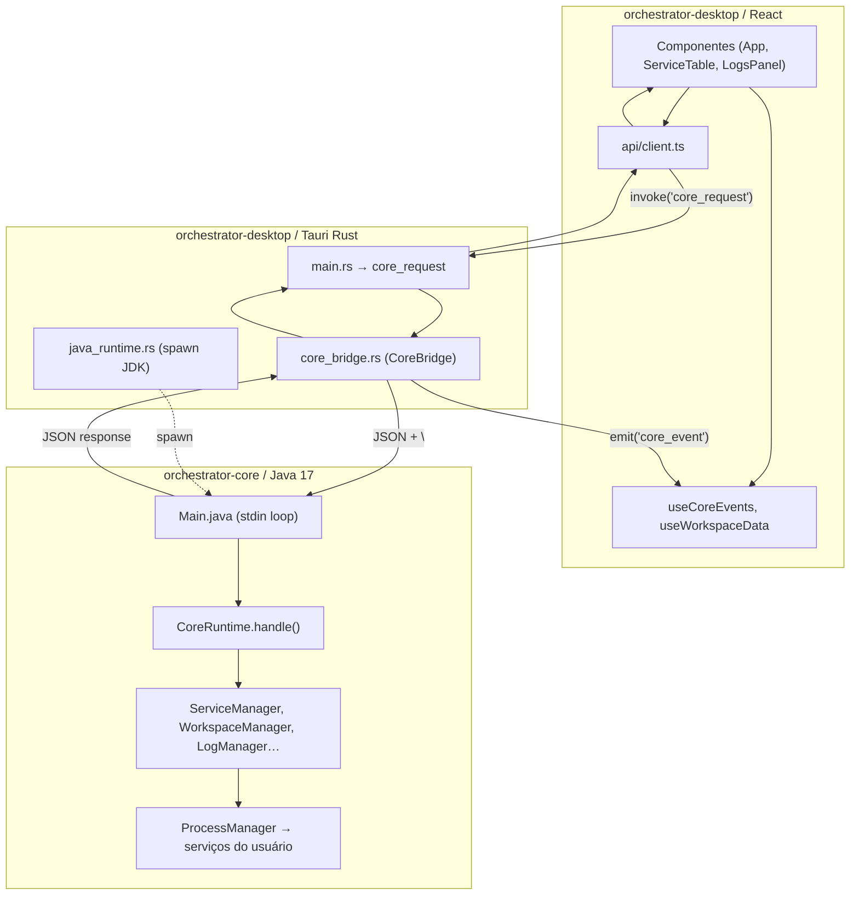
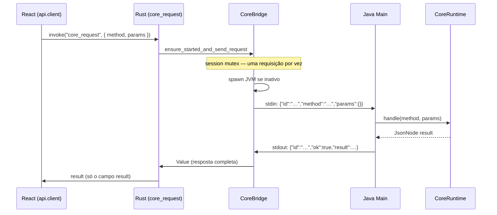
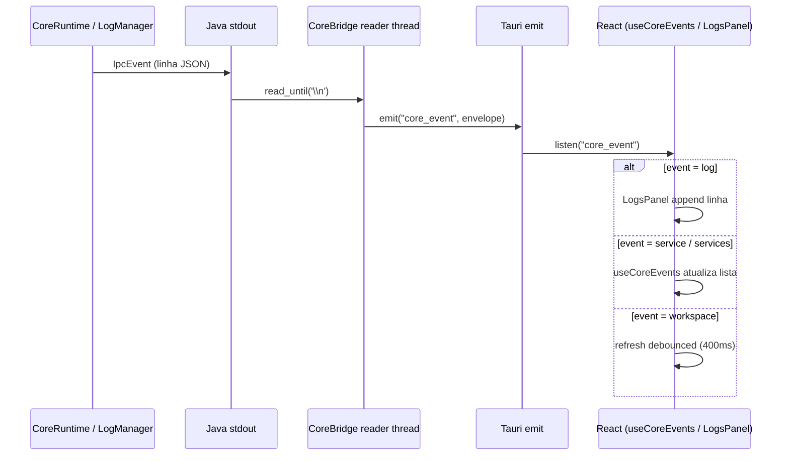
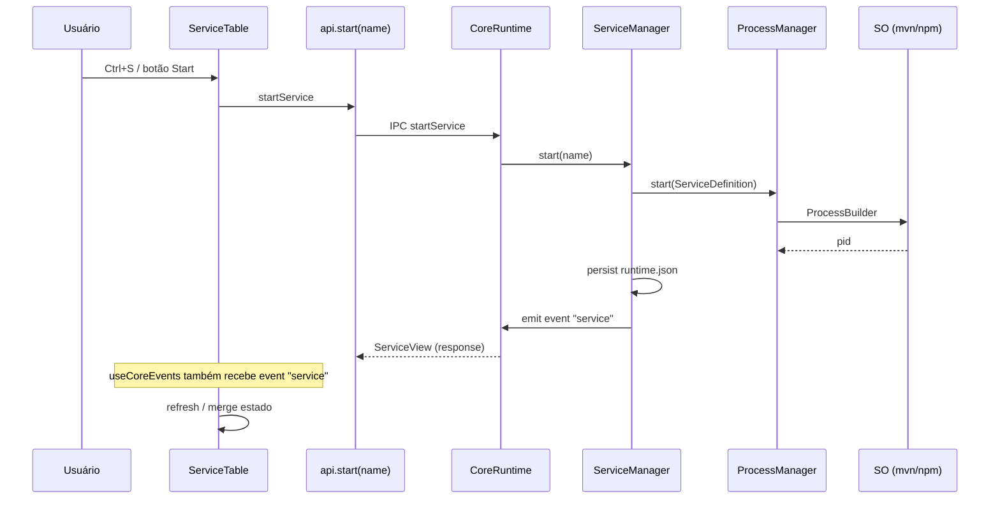
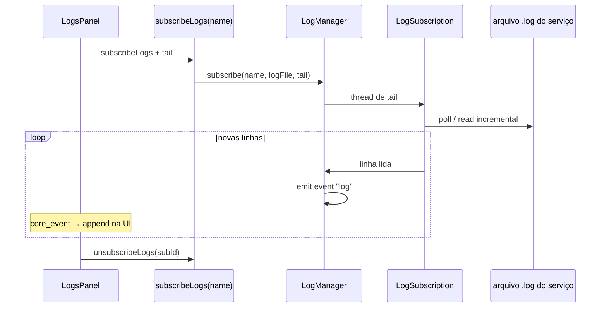

# Integração Java ↔ Desktop

Visão completa de como o **React**, o **Tauri (Rust)** e o **core Java** se comunicam — do clique na UI até a execução local de um serviço.

Documento complementar: [`reference/IPC.md`](../reference/IPC.md) (tabela de métodos).

---

## Visão geral

O desktop **não embute** o Java no processo Rust. O core roda como **processo filho** (`java -jar orchestrator-core-standalone.jar`), com troca de mensagens via **stdin/stdout** (uma linha JSON por mensagem).



---

## Três camadas de transporte

| Camada | Tecnologia | Responsabilidade |
| --- | --- | --- |
| **UI** | React + TypeScript | Estado, telas, `api.*` e listeners `core_event` |
| **Shell** | Tauri 2 + Rust | Comandos nativos, spawn do JVM, ponte IPC, eventos para o WebView |
| **Core** | Java (JAR) | Regras de negócio, persistência, start/stop de processos, logs |

---

## Dois canais de comunicação

### 1. Requisição síncrona (request → response)

Usado para quase todas as ações da UI (listar, iniciar, parar, importar, etc.).



**Formato na fio stdin/stdout:**

```json
{"id":"uuid","method":"startService","params":{"name":"api-gateway"}}
{"id":"uuid","ok":true,"result":{…},"error":null}
```

**Erros:** Java devolve `ok: false` com `error.code` (`BAD_REQUEST`, `INTERNAL_ERROR`). Rust transforma em `Err("[CODE] mensagem")` para o React.

### 2. Eventos assíncronos (push)

O core escreve linhas **sem** aguardar pedido da UI — principalmente **logs** e **atualizações de estado**.

```json
{"event":"log","payload":{"subId":"…","service":"api","line":"…"}}
{"event":"service","payload":{…ServiceView…}}
{"event":"services","payload":[…]}
{"event":"workspace","payload":{…Workspace…}}
```



---

## Ciclo de vida do processo Java

| Momento | O que acontece |
| --- | --- |
| Abrir o app | Core **não** sobe no `setup` do Tauri |
| Primeira chamada `api.*` | `CoreBridge` faz `spawn_core` → `java -jar … --stateDir …` |
| Reader thread | Lê stdout linha a linha; roteia por `id` (response) ou `event` (push) |
| Timeout 45s | Rust mata o JVM e limpa requests pendentes |
| Troca de Java nas Configurações | `set_java_runtime_path` → `bridge.cleanup()` → próximo request respawna |
| Fechar o app | `RunEvent::Exit` → `bridge.shutdown()` |

**JAR em dev:** `ORCHESTRATOR_CORE_JAR` ou `orchestrator-core/target/orchestrator-core-standalone.jar`.  
**JAR em release:** bundle em `resource_dir/orchestrator-core-standalone.jar`.

**Logs de diagnóstico:** `desktop-logs/core.stderr.log` (stderr do JVM). Trace: `ORCHESTRATOR_CORE_TRACE=1`.

---

## Exemplo: iniciar um serviço



O **mesmo** `startService` devolve o `ServiceView` na resposta HTTP-like **e** pode emitir `event: service` para outras abas já abertas.

---

## Exemplo: assinar logs



Logs **não** voltam no `result` do `subscribeLogs` — só o `subId`. O stream é 100% por eventos `log`.

---

## Mapa de arquivos por etapa

| Etapa | Arquivo |
| --- | --- |
| Botão na UI | `orchestrator-desktop/src/ui/ServiceTable.tsx`, `App.tsx` |
| Cliente tipado | `orchestrator-desktop/src/api/client.ts` |
| Fila serial (Windows) | `enqueueCoreRequest` em `client.ts` |
| Comando Tauri | `orchestrator-desktop/src-tauri/src/main.rs` → `core_request` |
| Ponte IPC | `orchestrator-desktop/src-tauri/src/core_bridge.rs` |
| Spawn Java | `orchestrator-desktop/src-tauri/src/java_runtime.rs` |
| Loop stdin | `orchestrator-core/.../core/Main.java` |
| Dispatch | `orchestrator-core/.../core/runtime/CoreRuntime.java` |
| Start/stop | `ServiceManager.java`, `ProcessManager.java` |
| Eventos UI | `useCoreEvents.ts`, `LogsPanel.tsx`, `MonitorPanel.tsx` |
| Contrato métodos | `docs/reference/IPC.md` |

---

## Timeouts e concorrência

| Local | Valor | Efeito |
| --- | --- | --- |
| `core_bridge.rs` recv | 45s | Mata JVM se core não responder |
| `api/client.ts` | 45s | Rejeita Promise no React |
| `App` bootstrap | 90s | Toast se primeira carga falhar |
| Fila `client.ts` | serial | Um IPC por vez (evita corrida no Windows) |
| `session` mutex Rust | exclusivo | `ensure_started` + send + cleanup não intercalam |

**Retry:** uma tentativa extra em `CORE_SHUTDOWN` ou erro de transporte (`core_bridge.rs`).

---

## Comandos Tauri fora do core Java

Estes **não** passam pelo JAR — são tratados só no Rust:

| Comando | Uso |
| --- | --- |
| `select_folder` | Importar roots |
| `select_java_folder` / `select_java_file` | Configurações → JDK |
| `get_runtime_settings` / `set_java_runtime_path` | Persistir Java do core |

---

## Persistência (contexto da integração)

O core recebe `--stateDir` do Rust e grava:

| Arquivo | Conteúdo |
| --- | --- |
| `workspace.json` | Serviços, containers, roots |
| `runtime.json` | PID e status por serviço |

A UI lê estado via IPC (`listServices`, `getWorkspace`), não acessa esses arquivos diretamente.

---

## Como estender o fluxo

1. Novo caso de uso → `CoreRuntime.handle` + manager adequado  
2. Expor na UI → `api/client.ts` + `api/types.ts`  
3. Se precisar push → `emitEvent.accept("…", payload)` no Java  
4. Se precisar reagir na UI → `listen("core_event")` ou `useCoreEvents`  
5. Atualizar [`reference/IPC.md`](../reference/IPC.md)
